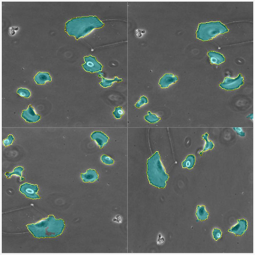
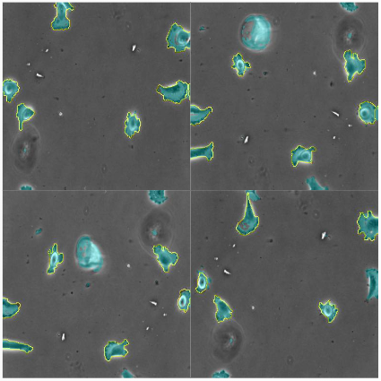
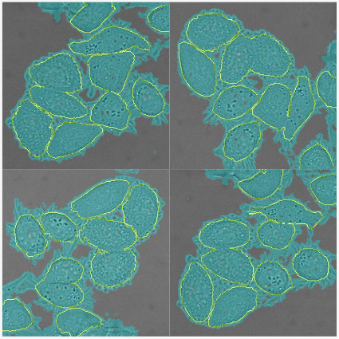
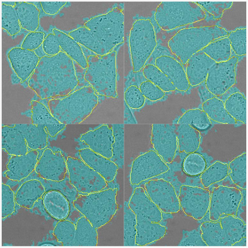

# U-Net Re-Implementation with PyTorch

This implementation is based on the ["U-Net: Convolutional Networks for Biomedical Image Segmentation"](https://arxiv.org/abs/1505.04597) paper that was published at MICCAI 2015. U-Net was proposed for segmentation tasks. But now, it is the go-to architecture for most dense prediction tasks including depth prediction and flow estimation.

## Setup

### Download data

Use the [download-data.sh](./download-data.sh) script to download and extract the following datasets.

1. ISBI-2015 Segmentation
2. ISBI-2015 Cell Tracking Tasks
    1. PhC-U373
    2. DIC-HeLa

These will take up 104M of disk space

### Setup environment

Create the anaconda environment `unet` from the following command and activate it.

```bash
conda create -f environment.yaml
```

### Training and Evaluation

This was developed and trained on a single Quadro RTX 5000 GPU with 16GB memory. Three separate training jobs can be invoked in the background by invoking the shell script [main.sh](./main.sh).

```bash
bash main.sh
```

If your GPU is insufficient, you may invoke the three jobs individually. Each job will do the training and then the evaluation.

This repository uses the [multitask-pipeline](https://github.com/Avishka-Perera/multitask-pipeline) as a submodule for the training pipeline. Read the [wiki](https://github.com/Avishka-Perera/multitask-pipeline/wiki/1-Multitask-Pipeline) to learn more about how to use this multitask-pipeline.

## Results

In the following image, yellow borders represent the ground truth segmentation, while the cyan overlay represents the model prediction.



    PhC-U373 Training set; IoU: 96.5%



    PhC-U373 Validation set; IoU: 96.0%



    DIC-HeLa Training set; IoU: 68.0%



    DIC-HeLa Validation set; IoU: 68.7%

## Acknowledgments

This implementation was done as a part of a presentation that I did for the In19-S8-EN4583 - Advances in Machine Vision course at the University of Moratuwa, Sri Lanka on 01.02.2024. The presentation slides are publicly available as Google Slides [here](https://docs.google.com/presentation/d/1Mhxy69_MEJfIeDT7Iqn7tFfGMM76cSt3d5Ye8RaODEo/edit?usp=sharing).
